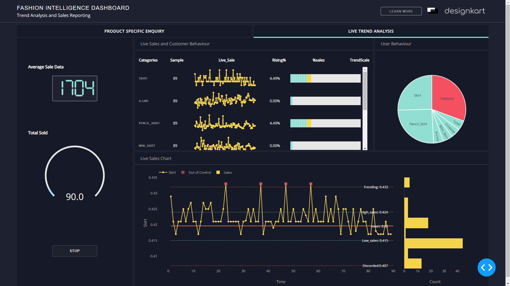
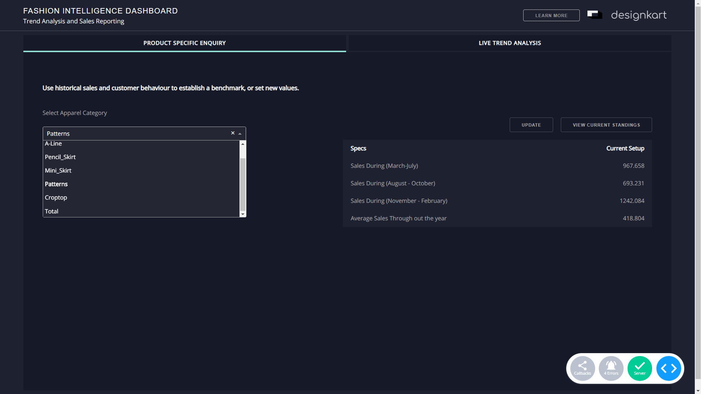

# Fashion Intelligence dashoboard

## Introduction
`dash-fashion-intelligence` is a dashboard made by `Team Ignitors` for monitoring user behaviour and sales data to analyse the product trend. . 

## Screenshots




## Built With
* [Dash](https://dash.plot.ly/) - Main server and interactive components 
* [Plotly Python](https://plot.ly/python/) - Used to create the interactive plots
* [Dash DAQ](https://dash.plot.ly/dash-daq) - Styled technical components for industrial applications

## Requirements
We suggest you to create a separate virtual environment running Python 3 for this app, and install all of the required dependencies there. Run in Terminal/Command Prompt:

```
git clone https://github.com/Debanitrkl/FlipkartGrid.git
cd dash-fashion-intelligence/
python3 -m virtualenv venv
```
In UNIX system: 

```
source venv/bin/activate
```
In Windows: 

```
venv\Scripts\activate
```

To install all of the required packages to this environment, simply run:

```
pip install -r requirements.txt
```

and all of the required `pip` packages, will be installed, and the app will be able to run.


## How to use this app

Run this app locally by:
```
python app.py
```
Open http://0.0.0.0:8050/ in your browser, you will see a live-updating dashboard.

Click on **Learn more** button to learn more about how this app works.

## What does this app shows
Click on buttons in `Categories` column to visualize details of measurement trendlines on the bottom panel.
The sparkline on top panel and control chart on bottom panel show process monitor using scraping data. The trend is updated every other second to simulate real-time measurements. when the product surge is more than usual(resulting in out of stock) it is cited as 'Out of Control(OOC)' and are marked in red
Clicking on `Stop` button the live trend analysis will stop , and going to specification parameters by clicking specification tab, you can get sales infrormation on specific categories.
## Resources and references
* [Dash User Guide](https://dash.plot.ly/)
